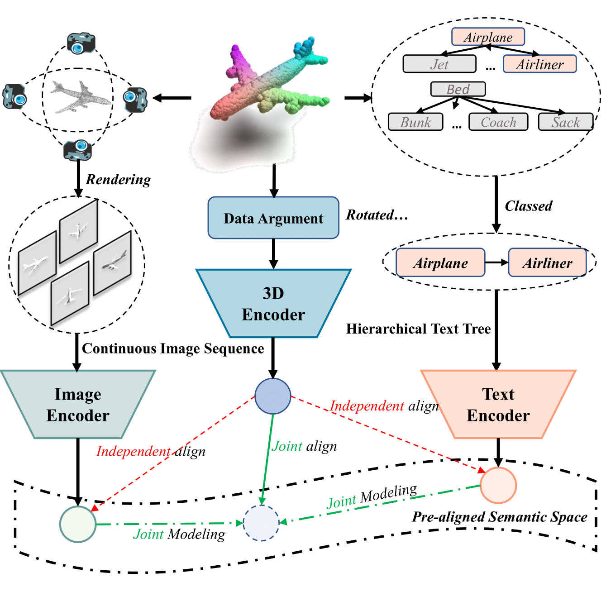
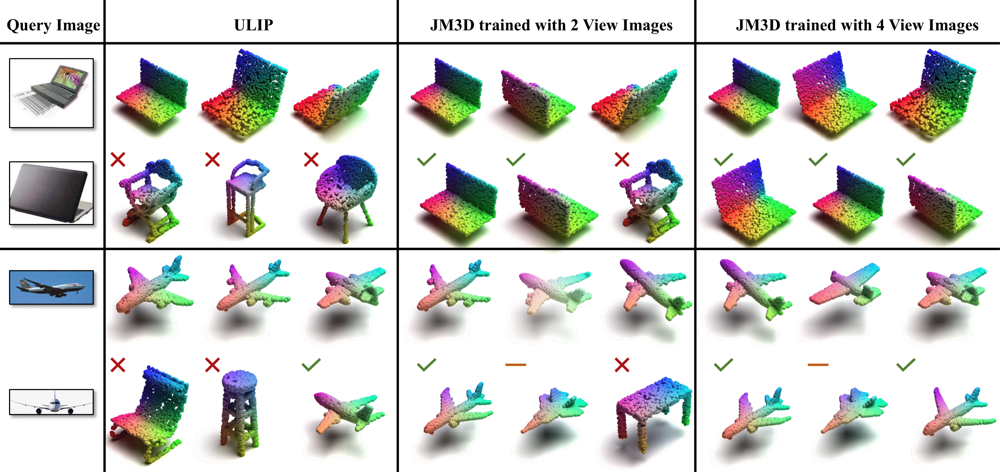
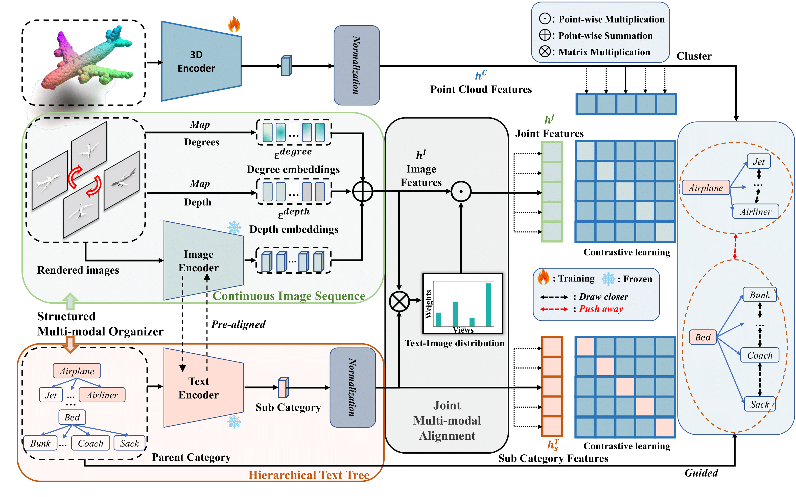

# Beyond First Impressions: Integrating Joint Multi-modal Cues for Comprehensive 3D Representation
The offical implemention of JM3D.

# What is JM3D
JM3D is a Joint Multi-modal framework for unified 3D understanding, which constructs structured vision and language information for joint modeling to improve the representation learning of 3D models without extra latency.


# What can we do
## Cross-modal Retrieval
We present more accurate results in more challenge scenes like the head of plane and the back of the laptop.


## Zero-shot on Model
Zero-shot classification on ModelNet40 with 8192 points.
| Models | top-1  | top-5 |
| :-----| :----: | :----: |
| [PointNet2(ssg)](https://drive.google.com/file/d/1gZ6nCUrKAezFezUidj1unKI6-fby2f4k/view?usp=sharing) | 62.2 | 79.3 |
| [PointMLP](https://drive.google.com/file/d/14HMMemeEJI2oUA3K8UPoFczr24M3x0d6/view?usp=sharing) | 65.8 | 82.1 |
| [PointBERT](https://drive.google.com/file/d/1rdV5zH09-tuxm3OG9iNUAVSbJA8ZEzPE/view?usp=sharing) | 61.8 | 81.7 |
# Instruction
## Environments
Follow the [requirements](requirements.txt), the code is trained with CUDA>=11.0 and pytorch>=1.10.1. Follow the command that:
```shell
conda create -n jm3d python=3.7.15
conda activate jm3d
conda install pytorch==1.10.1 torchvision==0.11.2 torchaudio==0.10.1 cudatoolkit=11.3 -c pytorch -c conda-forge
pip install -r requirements.txt
```
To train PointMLP, the [pointnet2_ops_lib](https://github.com/ma-xu/pointMLP-pytorch/tree/main/pointnet2_ops_lib) is needed. Download it and install it as:
```python
pip install pointnet2_ops_lib/.
```
For PointBERT, the [extensions](https://github.com/lulutang0608/Point-BERT/tree/master/extensions) and other libraries are needed. Download it and install it as:
``` python
# Chamfer Distance
cd extensions/chamfer_dist
python setup.py install --user

# EMD
cd extensions/emd
python setup.py install --user

# GPU KNN
pip install Ninja
pip install --upgrade https://github.com/unlimblue/KNN_CUDA/releases/download/0.2/KNN_CUDA-0.2-py3-none-any.whl
```

## Dataset
Download the dataset on the [data](data), which will be like:
```
./data
|-- ScanObjectNN
|   |-- ScanObjectNN_shape_names.txt
|   |-- main_split
|   |-- main_split_nobg
|-- modelnet40_normal_resampled
|   |-- modelnet10_test_1024pts.dat
|   |-- modelnet10_test_1024pts_fps.dat
|   |-- modelnet10_train_1024pts.dat
|   |-- modelnet10_train_1024pts_fps.dat
|   |-- modelnet40_shape_names.txt
|   |-- modelnet40_shape_names_modified.txt
|   |-- modelnet40_test.txt
|   |-- modelnet40_test_1024pts.dat
|   |-- modelnet40_test_1024pts_fps.dat
|   |-- modelnet40_test_8192pts_fps.dat
|   |-- modelnet40_train.txt
|   |-- modelnet40_train_1024pts.dat
|   |-- modelnet40_train_1024pts_fps.dat
|   |-- modelnet40_train_8192pts_fps.dat
|-- shapenet-55
|   |-- rendered_images
|   |-- shapenet_pc
|   |-- taxonomy.json
|   |-- test.txt
|   |-- train.txt
|-- initialize_models
|   |-- point_bert_pretrained.pt
|   |-- slip_base_100ep.pt
|-- ModelNet40.yaml
|-- ScanObjectNN.yaml
|-- ShapeNet-55.yaml
|-- dataset_3d.py
|-- dataset_catalog.json
|-- labels.json
|-- templates.json
```
The ModelNet40, ShapeNet55 and the initialize_models can be downloaded from [here](https://console.cloud.google.com/storage/browser/sfr-ulip-code-release-research;tab=objects?prefix=&forceOnObjectsSortingFiltering=false), and the ScanObjectNN can be downloaded from [here](https://hkust-vgd.github.io/scanobjectnn/).

If you change your path of data, you should change the path config in the (dataset).yaml. To use your customized dataset, you should set a new \*.yaml and a new function in [dataset_3d.py](data/dataset_3d.py).
## Train
**_Note_** : **The default number of point is 8192 to be same as the previous work. You can modify the number of points to adapt your work space. By the way, we use the FPS to downsample the point clouds, which is time costed. The pre-processed data will speed up your training with a little performance drop.** 

Three backbones of PointMLP, PointNet++(ssg), and PointBERT are supported. You can modify your own configs in scripts for gpus, text usage, or the other setting in args.
```shell
# the scripts are named by its correspoinding 3D backbone name.
bash ./scripts/(choose your pre-train script)
```
## Zero-shot Test
Be similiar to training, you can use:
```shell
bash ./scripts/(choose your test script) /path/to/your/checkpoint.pt
```
## Croos-modal Retrieval
Same as zero-shot, you should change the `test_zeroshot_3d_core()` in `test_zeroshot_3d()` to `cross_retrived()`

# Pretrained Models
We provide the pretrained models for PointMLP, PointNet++(ssg), and PointBERT. The models can be downloaded from [here](https://drive.google.com/drive/folders/1qRO1IzkPn6InSl1Sx0ACzsbWAXRHxizv?usp=sharing).

# TODO
More supported backbone and the v2 is coming soon!

# Acknowledgements
Thanks to the code base from [ULIP](https://github.com/salesforce/ULIP).
<!-- # Pipeline
 -->
